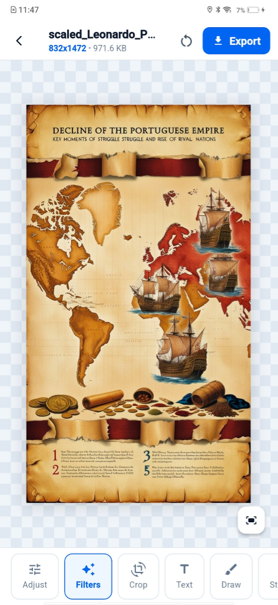

# Photo Editor

A modern, minimal Flutter photo editing application built with Material 3.

<p align="center">
  
</p>

## Features

- **Image Picker**: Choose photos from your device gallery, take pictures directly with your camera, or load built-in sample artwork.
- **Interactive Canvas**: High-performance pan, pinch-to-zoom (0.2x–6.0x), and one-tap view reset.
- **Image Metadata**: Displays real-time resolution and file size.
- **Modular Toolbar**: Ready-to-use editing categories for Adjustments, Filters, Crop & Rotate, Text, Drawing, and Stickers.
- **Light Theme**: Clean, distraction-free white theme.

## Getting Started

### Prerequisites
- [Flutter SDK](https://docs.flutter.dev/get-started/install) (v3.44.0+)
- Android / iOS device or emulator, or Desktop / Web target

### Installation & Run

1. Clone or open the repository:
   ```bash
   git clone https://github.com/Hirthick-roshan-dev/photo-editor.git
   cd photo-editor
   ```

2. Install dependencies:
   ```bash
   flutter pub get
   ```

3. Run the application:
   ```bash
   flutter run
   ```
